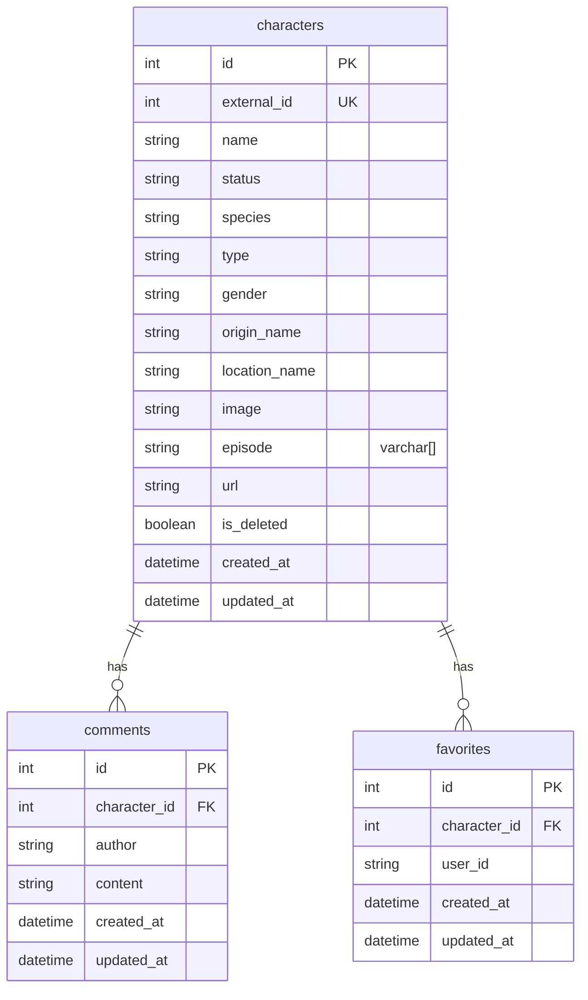

# Rick & Morty Explorer

**Blossom — Full Stack Developer Technical Test**

A full-stack application to search, filter, favorite, and comment on characters from the [Rick and Morty API](https://rickandmortyapi.com/). Built with React, GraphQL, Express, PostgreSQL, Redis, and Docker.

**Repository:** [github.com/m1gue21/blossom-test](https://github.com/m1gue21/blossom-test)

---

## Table of contents

1. [Overview](#overview)
2. [Tech stack](#tech-stack)
3. [Architecture](#architecture)
4. [Prerequisites](#prerequisites)
5. [Run with Docker (recommended)](#run-with-docker-recommended)
6. [Run locally (without Docker)](#run-locally-without-docker)
7. [Environment variables](#environment-variables)
8. [Database migrations & seed](#database-migrations--seed)
9. [API reference (GraphQL)](#api-reference-graphql)
10. [ERD](#erd-diagram)
11. [Project structure](#project-structure)
12. [Testing](#running-tests)
13. [Design patterns](#design-patterns-used)
14. [Troubleshooting](#troubleshooting)
15. [Push to GitHub](#push-to-github)

---

## Overview

### Frontend

- Character list with search, filters (species, status, gender, origin, name), and A→Z / Z→A sort
- Split views: starred vs other characters (with server-side filtering)
- Character detail: species, status, occupation, favorites, comments, soft delete
- Responsive layout (including mobile “Advanced search” flow)
- Apollo Client → GraphQL; Vite dev server proxies `/graphql` to the backend

### Backend

- **Express** + **Apollo Server** (GraphQL) on `/graphql`
- Filters: **name, status, species, gender, origin** (via Sequelize)
- **PostgreSQL** + **Sequelize** migrations
- **Redis** cache for list/detail queries (invalidation on mutations)
- **15 characters** seeded from the public API
- Request **logging** middleware
- **Cron** job every **12 hours** to sync characters from the API
- **`@MeasureTime`** decorator on selected service methods
- **Swagger UI** at `/api-docs` (OpenAPI-style docs for GraphQL operations)

---

## Tech stack

| Layer    | Technology |
|----------|------------|
| Frontend | React 18, TypeScript, Vite, Apollo Client, TailwindCSS, React Router |
| Backend  | Node.js 20, TypeScript, Express, Apollo Server, GraphQL |
| Database | PostgreSQL 16, Sequelize, migrations |
| Cache    | Redis 7 (ioredis) |
| DevOps   | Docker Compose, Nginx (static frontend in production) |
| Tests    | Vitest + Testing Library (frontend), Jest (backend) |

---

## Architecture

- **Browser → Frontend (Nginx in Docker, port 3000)** serves the SPA. Requests to **`/graphql`** are **reverse-proxied** to the backend container (`backend:4000`), so the Apollo client can keep `uri: '/graphql'` with no CORS issues.
- **Local dev:** Vite on port **3000** proxies `/graphql` to `http://localhost:4000` (see `frontend/vite.config.ts`).
- **Backend** connects to **PostgreSQL** and **Redis** using hostnames `postgres` and `redis` inside Compose, or `localhost` when running the API on the host.

---

## Prerequisites

- **Node.js 20+** and **npm**
- **Docker** and **Docker Compose** (v2: `docker compose`)

---

## Run with Docker (recommended)

### 1. Clone

```bash
git clone https://github.com/m1gue21/blossom-test.git
cd blossom-test
```

(If you already have the folder as `blossom`, use that directory instead.)

### 2. Start all services

```bash
docker compose up -d --build
```

This builds and starts:

| Service    | Container name        | Host ports |
|------------|----------------------|------------|
| PostgreSQL | `rick_morty_postgres` | 5432     |
| Redis      | `rick_morty_redis`      | 6379     |
| Backend    | `rick_morty_backend`    | 4000     |
| Frontend   | `rick_morty_frontend`   | 3000 → 80 (Nginx) |

### 3. Initialize the database

Run **migrations**, then **seed** 15 characters:

```bash
docker exec rick_morty_backend npm run db:migrate
docker exec rick_morty_backend npx ts-node src/database/seeds/seedCharacters.ts
```

> The production image does not ship `ts-node` as a runtime dependency; `npx ts-node` pulls it on the fly for the one-off seed. Alternatively, run `npm run db:seed` from the `backend/` folder on your machine (see [Local setup](#run-locally-without-docker)) with `DB_HOST=localhost` while Postgres is exposed on 5432.

### 4. Open the app

| What | URL |
|------|-----|
| **Web app** | http://localhost:3000 |
| **GraphQL Playground** | http://localhost:4000/graphql |
| **Swagger / API docs** | http://localhost:4000/api-docs |
| **OpenAPI JSON** | http://localhost:4000/api-docs.json |

### Rebuild after code changes

```bash
docker compose build backend frontend
docker compose up -d
```

---

## Run locally (without Docker)

### 1. PostgreSQL & Redis

Use Docker only for data stores:

```bash
docker run -d --name rm-postgres \
  -e POSTGRES_DB=rick_morty_db \
  -e POSTGRES_USER=postgres \
  -e POSTGRES_PASSWORD=postgres \
  -p 5432:5432 postgres:16-alpine

docker run -d --name rm-redis -p 6379:6379 redis:7-alpine
```

### 2. Backend

```bash
cd backend
npm install
cp .env.example .env
# Edit .env: DB_* and REDIS_* pointing to localhost

npm run db:migrate
npm run db:seed

npm run dev
```

API: http://localhost:4000

### 3. Frontend

```bash
cd frontend
npm install
npm run dev
```

App: http://localhost:3000 (Vite proxies `/graphql` → `http://localhost:4000`)

---

## Environment variables

Used by the backend (`backend/.env` or Compose `environment:`):

| Variable | Description | Typical value |
|----------|-------------|----------------|
| `PORT` | HTTP port | `4000` |
| `NODE_ENV` | Environment | `development` / `production` |
| `DB_HOST` | PostgreSQL host | `localhost` or `postgres` (Docker) |
| `DB_PORT` | PostgreSQL port | `5432` |
| `DB_NAME` | Database name | `rick_morty_db` |
| `DB_USER` | Database user | `postgres` |
| `DB_PASSWORD` | Database password | (set in `.env`) |
| `REDIS_HOST` | Redis host | `localhost` or `redis` (Docker) |
| `REDIS_PORT` | Redis port | `6379` |
| `RICK_MORTY_API_URL` | Upstream API base URL | `https://rickandmortyapi.com/api` |

The frontend does not require a separate `.env` for GraphQL in this repo: it uses relative `/graphql` (proxy in dev and Nginx in production).

---

## Database migrations & seed

| Command | Description |
|---------|-------------|
| `npm run db:migrate` | Apply Sequelize migrations |
| `npm run db:migrate:undo` | Roll back all migrations |
| `npm run db:seed` | Fetch and upsert 15 characters (IDs 1–15) from the Rick and Morty API |

Run these from `backend/` or via `docker exec rick_morty_backend …` as shown above.

---

## API reference (GraphQL)

Endpoint: **`POST /graphql`** (JSON body with `query` / `variables`).

### Queries

#### `characters` — list with filters

```graphql
query GetCharacters(
  $name: String
  $status: String       # e.g. Alive | Dead | unknown
  $species: String
  $gender: String       # Female | Male | Genderless | unknown
  $origin: String
  $page: Int
  $sort: SortOrder      # asc | desc
  $userId: String       # used for isFavorite and starred sections
) {
  characters(
    name: $name
    status: $status
    species: $species
    gender: $gender
    origin: $origin
    page: $page
    sort: $sort
    userId: $userId
  ) {
    results {
      id
      name
      status
      species
      gender
      image
      originName
      locationName
      isFavorite
      isDeleted
    }
    total
    page
    pages
  }
}
```

#### `character` — single character + comments

```graphql
query GetCharacter($id: Int!, $userId: String) {
  character(id: $id, userId: $userId) {
    id
    name
    status
    species
    type
    gender
    originName
    locationName
    image
    episode
    isFavorite
    comments {
      id
      author
      content
      createdAt
    }
  }
}
```

### Mutations

```graphql
mutation AddComment($characterId: Int!, $author: String!, $content: String!) {
  addComment(characterId: $characterId, author: $author, content: $content) {
    id
    author
    content
    createdAt
  }
}

mutation ToggleFavorite($characterId: Int!, $userId: String!) {
  toggleFavorite(characterId: $characterId, userId: $userId)
}

mutation SoftDelete($id: Int!) {
  softDeleteCharacter(id: $id) {
    id
    isDeleted
  }
}
```

Full operation examples and bodies for Swagger are documented in code under `backend/src/routes/graphql.docs.ts`.

---

## ERD diagram

PostgreSQL schema (Sequelize migrations in `backend/src/database/migrations/`). Rendered below via **Mermaid** (supported on GitHub).



| From | To | Cardinality | Foreign key | Notes |
|------|-----|---------------|-------------|--------|
| `characters` | `comments` | 1 : N | `comments.character_id` → `characters.id` | `ON DELETE CASCADE` |
| `characters` | `favorites` | 1 : N | `favorites.character_id` → `characters.id` | `ON DELETE CASCADE`; **unique** `(character_id, user_id)` |

`favorites.user_id` is an app-level user string (no `users` table). **DBML** for [dbdiagram.io](https://dbdiagram.io) and an ASCII overview: [docs/database-erd.md](docs/database-erd.md).

---

## Project structure

```
blossom/
├── backend/
│   ├── src/
│   │   ├── config/           # DB, Swagger
│   │   ├── database/
│   │   │   ├── migrations/   # Sequelize migrations
│   │   │   └── seeds/        # Character seed script
│   │   ├── graphql/
│   │   │   ├── schema/
│   │   │   └── resolvers/
│   │   ├── jobs/             # Cron (12h sync)
│   │   ├── middleware/       # Request logger
│   │   ├── models/
│   │   ├── routes/           # Health, GraphQL docs for Swagger
│   │   ├── services/         # CharacterService, CacheService
│   │   ├── utils/            # @MeasureTime
│   │   ├── __tests__/
│   │   └── index.ts
│   ├── Dockerfile
│   └── package.json
├── frontend/
│   ├── src/
│   │   ├── components/
│   │   ├── graphql/
│   │   ├── pages/
│   │   ├── test/
│   │   └── ...
│   ├── Dockerfile
│   ├── nginx.conf            # SPA + /graphql → backend
│   └── vite.config.ts        # Dev proxy /graphql
├── docker-compose.yml
└── README.md
```

---

## Running tests

```bash
# Backend
cd backend && npm test

# Frontend
cd frontend && npm test
```

---

## Design patterns used

- **Service layer** — `CharacterService` centralizes data access and cache rules  
- **Cache-aside** — Redis checked before PostgreSQL; keys invalidated on writes  
- **Decorator** — `@MeasureTime` for timing selected methods  
- **Singleton-style modules** — e.g. shared `CacheService` / service instance  

---

## Troubleshooting

| Issue | What to try |
|-------|-------------|
| Port already in use | Stop other services on 3000, 4000, 5432, or 6379; or change ports in `docker-compose.yml` |
| Empty list in UI | Run migrations and seed ([Database](#database-migrations--seed)) |
| GraphQL network error in browser | Ensure backend is up and Nginx/Vite proxy `/graphql` is reachable |
| `db:seed` inside container fails | Use `npx ts-node src/database/seeds/seedCharacters.ts` as shown, or seed from host with `backend/.env` |

---

## Push to GitHub

If this folder is not yet a Git repository:

```bash
git init
git add .
git commit -m "Initial commit: Rick & Morty full stack app"
git branch -M main
git remote add origin https://github.com/m1gue21/blossom-test.git
git push -u origin main
```

If the remote already exists and you only need to push updates:

```bash
git add .
git commit -m "Describe your changes"
git push origin main
```

---

## License

This project was submitted as part of a technical assessment (Blossom / April 2026).
