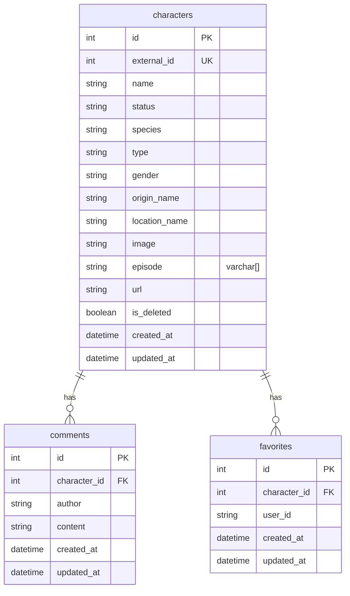

# Database ERD — Rick & Morty Explorer

PostgreSQL schema managed with Sequelize migrations (`backend/src/database/migrations/`).

The **same Mermaid ERD** is embedded in the root [**README.md**](../README.md#erd-diagram) so it renders on the repository home page.

## Entity-relationship diagram (Mermaid)

Use this in any Markdown viewer that supports Mermaid (GitHub, GitLab, VS Code preview).



### Relationships

| From | To | Cardinality | FK | Notes |
|------|-----|-------------|-----|--------|
| `characters` | `comments` | 1 : N | `comments.character_id` → `characters.id` | Cascade delete |
| `characters` | `favorites` | 1 : N | `favorites.character_id` → `characters.id` | Cascade delete; **unique** `(character_id, user_id)` |

`user_id` in `favorites` is an application string identifier (not a `users` table in this schema).

---

## DBML (dbdiagram.io / drawSQL)

Import at [dbdiagram.io](https://dbdiagram.io) → **Import** → paste:

```dbml
Table characters {
  id int [pk, increment]
  external_id int [not null, unique, note: 'API id']
  name varchar [not null]
  status varchar(50) [not null]
  species varchar(100) [not null]
  type varchar(100) [default: '']
  gender varchar(50) [not null]
  origin_name varchar [not null]
  location_name varchar [not null]
  image varchar [not null]
  episode varchar[] [note: 'PostgreSQL array']
  url varchar [not null]
  is_deleted boolean [default: false]
  created_at timestamp [not null]
  updated_at timestamp [not null]

  indexes {
    name
    status
    species
    gender
    is_deleted
  }
}

Table comments {
  id int [pk, increment]
  character_id int [not null, ref: > characters.id, note: 'ON DELETE CASCADE']
  author varchar(100) [not null]
  content text [not null]
  created_at timestamp [not null]
  updated_at timestamp [not null]

  indexes {
    character_id
  }
}

Table favorites {
  id int [pk, increment]
  character_id int [not null, ref: > characters.id, note: 'ON DELETE CASCADE']
  user_id varchar(100) [not null]
  created_at timestamp [not null]
  updated_at timestamp [not null]

  indexes {
    (character_id, user_id) [unique]
  }
}
```

---

## ASCII overview

```
┌─────────────────────────────────────────────────────────────┐
│                        characters                            │
├──────────────────┬──────────────────────────────────────────┤
│ id               │ SERIAL PK                                │
│ external_id      │ INT UNIQUE NOT NULL (Rick && Morty API)  │
│ name, status, …  │ VARCHAR / ARRAY / BOOLEAN                │
│ is_deleted       │ BOOLEAN DEFAULT false                    │
└────────┬─────────┴──────────────────────────────────────────┘
         │ 1
         │                ┌─────────────────────┐
         ├────────────────│ comments            │
         │            N   │ character_id FK     │
         │                │ author, content     │
         │                └─────────────────────┘
         │
         │                ┌─────────────────────┐
         └────────────────│ favorites         │
                      N   │ character_id FK     │
                          │ user_id (string)   │
                          │ UNIQUE(char_id,uid) │
                          └─────────────────────┘
```
